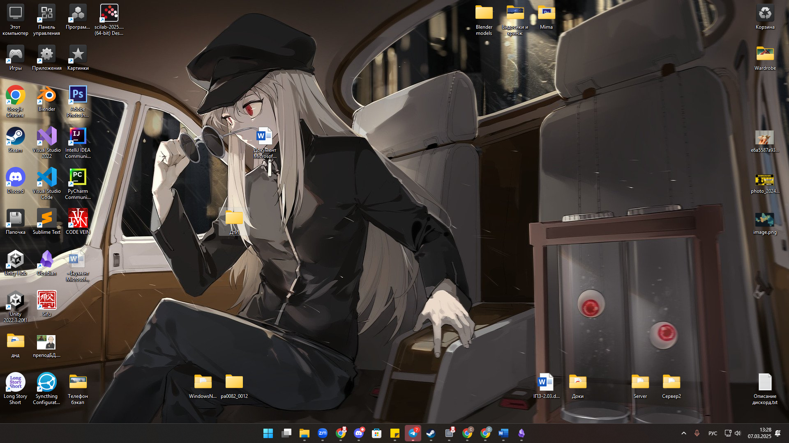
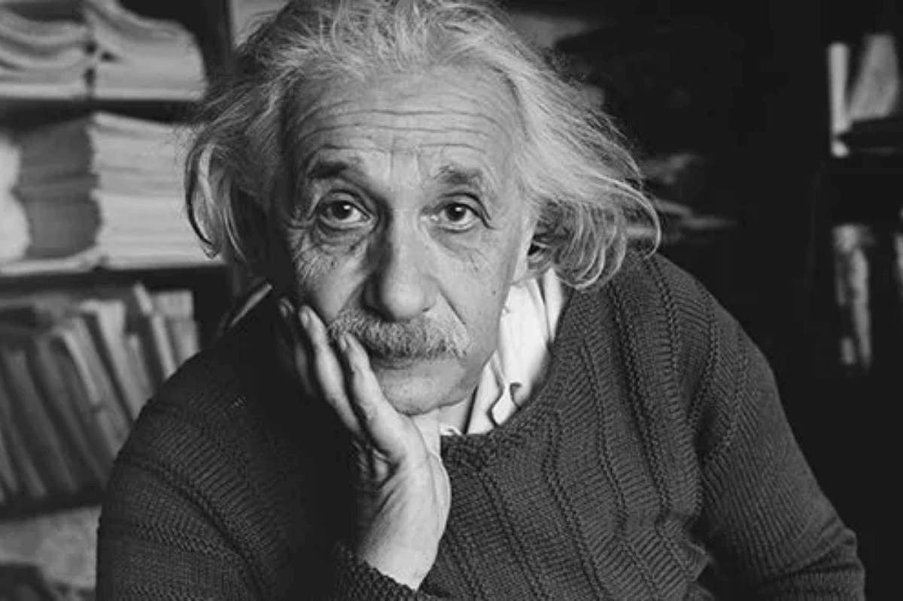
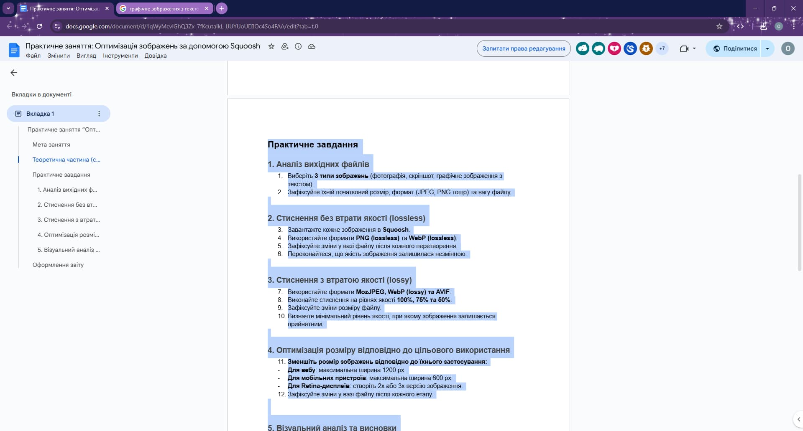
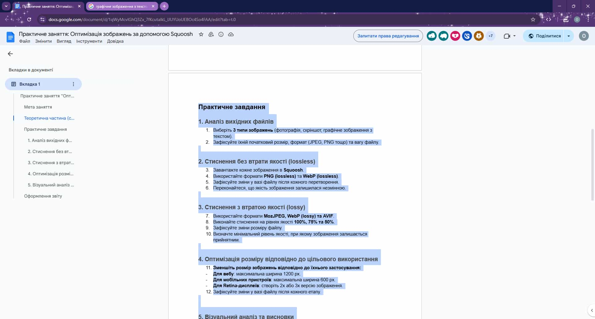
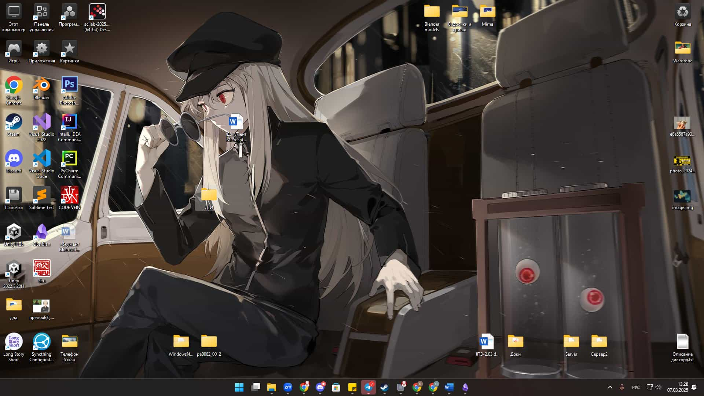

# Практична №1 - [Squoosh](https://squoosh.app/) оптимізація

## Виконала:  
**Матвєєнко Олександра**  
**Група: ІПЗ-2.03**

## 1. Опис початкових зображень

Перед оптимізацією використовувалися наступні зображення:
| Тип | Формат | Вага | Розмір |
|------|--------------|----------------|----------------|
| Текст | PNG | 183КБ | 1920x1032|
| Скриншот | PNG | 2488КБ | 1920x1080 |
| Фотографія | PNG | 305КБ | 1200x800 |

## 2. Таблиця порівняння розмірів файлів
### PNG (lossless) х WebP (lossless)
| Тип | PNG (lossless) | WebP (lossless) |
|------|--------------|----------------|
| Текст | 277КБ | 88КБ |
| Скриншот | 2169КБ | 1059КБ |
| Фотографія | 593КБ | 290КБ |

#### PNG (lossless)
/PNG(lossless)_TextImage.png)
/PNG(lossless)_Screenshot.png)
/PNG(lossless)_Photo.png)

#### WebP (lossless)
/WebP(lossless)_TextImage.webp)
/WebP(lossless)_Screenshot.webp)
/WebP(lossless)_Photo.webp)

### MozJPEG x WebP (lossy) x AVIF
| Тип         | MozJPEG 100% | WebP (lossy) 100% | AVIF 100% | MozJPEG 75% | WebP (lossy) 75% | AVIF 75% | MozJPEG 50% | WebP (lossy) 50% | AVIF 50% |
|------------|-------------|------------------|----------|-------------|------------------|----------|-------------|------------------|----------|
| Текст  | 533КБ      | 187КБ           | 119КБ   | 108КБ      | 82КБ            | 55КБ     | 75КБ       | 68КБ            | 41КБ     |
| Скриншот | 863КБ      | 490КБ           | 458КБ   | 177КБ      | 139КБ           | 169КБ    | 111КБ      | 104КБ           | 83КБ     |
| Фотографія | 350КБ      | 213КБ           | 251КБ   | 65КБ       | 44КБ            | 54КБ     | 43КБ       | 32КБ            | 26КБ     |

#### MozJPEG
##### MozJPEG 100%

##### MozJPEG 75%

##### MozJPEG 50%

#### WebP (lossy)
##### WebP (lossy) 100%
/WebP(lossy)100/WebP(lossy)_TextImage_100.webp)
/WebP(lossy)100/WebP(lossy)_Screenshot_100.webp)
/WebP(lossy)100/WebP(lossy)_Photo_100.webp)

##### WebP (lossy) 75%
/WebP(lossy)75/WebP(lossy)_TextImage_75.webp)
/WebP(lossy)75/WebP(lossy)_Screenshot_75.webp)
/WebP(lossy)75/WebP(lossy)_Photo_75.webp)

##### WebP (lossy) 50%
/WebP(lossy)50/WebP(lossy)_TextImage_50.webp)
/WebP(lossy)50/WebP(lossy)_Screenshot_50.webp)
/WebP(lossy)50/WebP(lossy)_Photo_50.webp)

#### AVIF
##### AVIF 100%

##### AVIF 75%

##### AVIF 50%

## 3. Висновки
### WebP (lossless)
- WebP (lossless) значно зменшує розмір файлів у порівнянні з PNG, зберігаючи якість
- Зображення майже в 3 рази меньше важить у порівняні з PNG
- WebP (lossless) ідеально підходить для випадків, коли важливо зберегти якість без втрат, зменшуючи розмір файлу

### AVIF
- AVIF забезпечує найменший розмір файлів серед усіх форматів незалежно від рівня якості
- AVIF залишається лідером у максимальному стисненні без значної втрати якості
- Стискає краще за всі формати

### WebP (lossy) та MozJPEG
- WebP (lossy) – хороший баланс між якістю та розміром
- Він займає менше місця, ніж MozJPEG, але трохи більше, ніж AVIF

## 4. Рекомендації
- Для збереження чіткості тексту найкраще використовувати WebP або AVIF на 75% якості
- Для фотографій і скриншотів оптимальним вибором буде WebP або AVIF на 100% або 75%
- Для Retina-дисплеїв потрібно створювати 2x або 3x версії зображень для кращої якості
