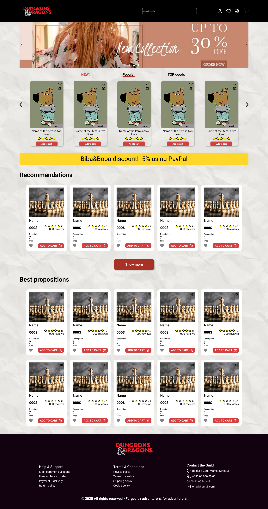
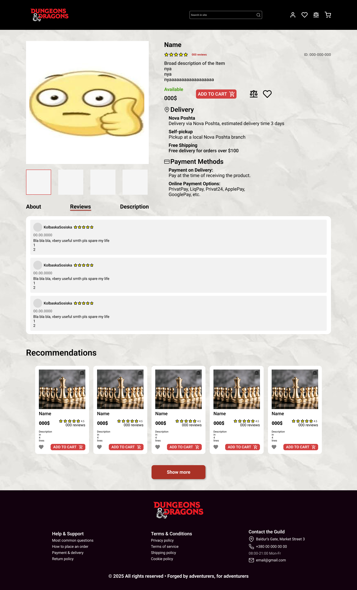
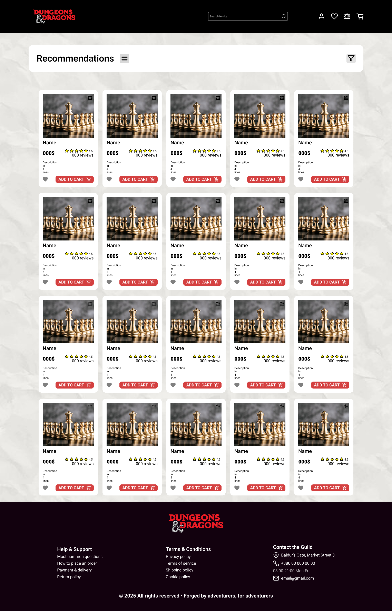

# Практична №10 Створення картки товару з використанням Auto Layout

## Виконала:  
**Матвєєнко Олександра**  
**Група: ІПЗ-2.03**  
[Посилання на проект в Фігма](https://www.figma.com/design/tHSENAGE9w26VYFvL16hLk/workshop_10?node-id=0-1&t=jaZhitdiemvx3hX3-1)  
[Посилання на Prototype](https://www.figma.com/proto/tHSENAGE9w26VYFvL16hLk/workshop_10?page-id=0%3A1&node-id=18-1945&p=f&viewport=-490%2C255%2C0.09&t=IeiqfaBIXqFAMlRE-1&scaling=scale-down-width&content-scaling=fixed&starting-point-node-id=18%3A1945)

## Завдання:
1. Створити деталізований вайрфрейм сайту для інтернет-магазину (головна сторінка та 2-3 сторінки товару). Тематику обрати самостійно. Розмір екранів - desktop
2. Використати інструменти прототипування і зробити клікабельний прототип на основі вайфрейму
3. До цього завдання прикріпити посилання на дизайн файл та клікабельний прототип
4. Написати звіт

---

## Хід роботи:
1. Аналіз
    - Аналіз інтерфейсів інших магазинів для натхнення.
    - Створення макету головної сторінки з ключовими елементами (категорії товарів, банери, фільтри)
    - Додавання сторінок товару, де будуть представлені деталі товару, ціна, відгуки та можливості покупки
    - Для інтерфейсу магазину вибрана тема DnD Merch, де будуть представлені різноманітні товари для любителів настільних ігор
2. Розробка
    - Вайрфрейм:
        - Вибрано Desktop розмір екрану
        - Створено головну сторінку, що включає основне меню, категорії товарів, рекламу новинок
        - Створено сторінки товарів, що включають основні зображення товарів, ціну, кнопки взаємодії, рейтинг та відгуки.
        - Використано прості компоненти (картки товару, меню, фільтри) для швидкого створення структури
    - Прототипування:
        - Створено клікабельний прототип, де користувач може переходити між головною сторінкою та сторінками товарів
        - Додані прості анімації переходів та інтерактивність
        - Використано інструменти Figma для зв’язку елементів у прототипі
3. Результати  
    | Елемент | Результат |
    | --- | --- |
    | Основна сторінка |  |
    | Сторінка товару |  |
    | Сторінка рекомендацій через кнопку |  |

    Посилання на проект: [workshop_10](https://www.figma.com/design/tHSENAGE9w26VYFvL16hLk/workshop_10?node-id=0-1&t=jaZhitdiemvx3hX3-1)  
    Посилання на прототип: [Prototype](https://www.figma.com/proto/tHSENAGE9w26VYFvL16hLk/workshop_10?page-id=0%3A1&node-id=18-1945&p=f&viewport=-490%2C255%2C0.09&t=IeiqfaBIXqFAMlRE-1&scaling=scale-down-width&content-scaling=fixed&starting-point-node-id=18%3A1945)
