# Практична №11 Дослідження кольорових гармоній та інструментів аналізу кольору в [Adobe Color](https://color.adobe.com/)

## Виконала:  
**Матвєєнко Олександра**  
**Група: ІПЗ-2.03**  
[Посилання на проект в Фігма](https://www.figma.com/design/OsqdFikXPzTZ1mFty4iHGv/workshop_11?node-id=0-1&t=N9cxZEhw2jUdl5Pv-1)

## Завдання:
1. Ознайомитися з поняттям кольорової гармонії, типами гармоній та колірними моделями
2. Створити палітри за різними принципами гармонії за допомогою Adobe Color
3. Згенерувати палітри зображень (Extract Theme) та градієнт (Extract Gradient)
4. Перевірити контрастність кольорових пар відповідно до стандартів доступності (WCAG)
5. Написати звіт

---

## Хід роботи:
1. Аналіз
    - Ознайомитись з типами кольорових гармоній: Analogous, Monochromatic, Triad, Complementary, Split Complementary, Square, Custom
    - Розібратися з відмінностями між колірними моделями RGB, HSB, LAB
    - Досліджено інтерфейс Adobe Color для створення гармоній та перевірки контрастності кольорів
2. Теоретична частина
    - Кольорова гармонія — це поєднання кольорів, яке викликає візуальну рівновагу та естетичне задоволення. Гармонія кольорів необхідна в дизайні для створення зрозумілих, зручних та привабливих інтерфейсів.
    - Типи гармоній:
        - Analogous — схожі кольори поруч на колі
        - Monochromatic — один колір у різній насиченості
        - Triad — три кольори, рівновіддалені на колі
        - Complementary — протилежні кольори
        - Split Complementary — два сусідніх до комплементарного
        - Square — чотири рівновіддалені кольори
        - Custom — побудова за власним вибором
    - Колірні моделі:
        - RGB — для цифрових екранів
        - HSB — відтінок, насиченість, яскравість
        - LAB — математична модель для точного порівняння
    - Контрастність і WCAG — Стандарти WCAG 2.1 встановлюють рівні доступності (AA, AAA) для тексту щодо фону. Контраст забезпечує читабельність для всіх користувачів
3. Результати
    - Color Wheel:
        - Створено палітри для кожного типу гармонії
        - Для кожної палітри зазначено базовий колір, зроблено скріншоти та додано короткий опис логіки побудови та передбачуваного емоційного ефекту  
            | Тип гармонії | Базовий колір | Скріншот | Логіка побудови і передбачуваний емоційний ефект |
            |--------------|---------------|----------|--------------------------------------------------|
            | Analogous | #E60901 | 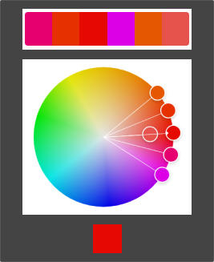 | Побудована на суміжних кольорах — спокійна, природна, м’яка палітра; комфортна для очей, головний колір + підтримка + акцент |
            | Monochromatic | #A501E6 | 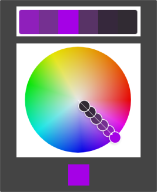 | Варіації одного кольору з різною яскравістю і насиченістю — виглядає гармонійно, спокійно |
            | Triad | #E6DC3D | 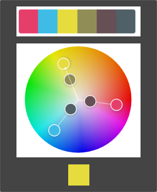 | Використано три рівновіддалені кольори на колі — жива, збалансована схема навіть із блідими кольорами; один домінує, два — акценти |
            | Complementary | #00E657 | 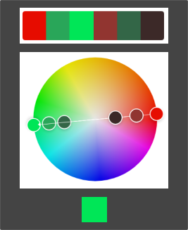 | Контрастна пара — кольори, розташовані напроти один одного на колі. Сильний контраст, виглядає яскраво та енергійно; підходить для акцентів |
            | Split Complementary | #00E657 | 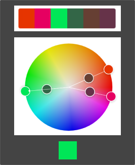 | Менш агресивна версія комплементарної. Базовий колір + два сусідні до його протилежного — все ще контрастна, але більш м’яка для очей; безпечний варіант для акцентів |
            | Square | #006AE5 | 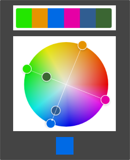 | Чотири кольори на однаковій відстані — яскрава, насичена палітра; варто обрати один домінуючий колір для балансу |
            | Custom | #392CE6 | 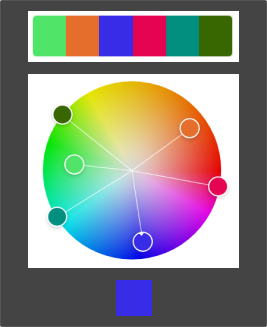 | Побудована інтуїтивно, за смаком дизайнера |
    - Extract Theme:
        - Завантажено зображення в розділ Extract Theme  
            
        - Створено дві палітри: Colorful та Muted  
            | Тип | Скріншот | Коментар |
            |-----|----------|----------|
            | Colorful | 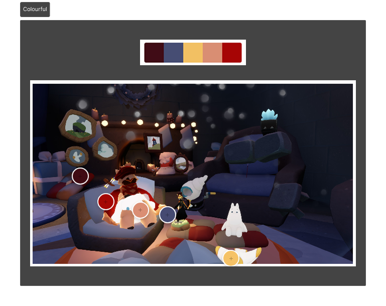 | Яскрава палітра, але дещо агресивна |
            | Muted | 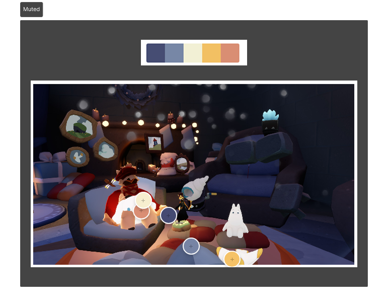 | Більш спокійна та гармонійна |  

            **Висновок:** Muted — краще для UI: спокійна, не відволікає, приємні кольори
    - Extract Gradient:
        - Завантажено те саме зображення в розділ Extract Gradient  
            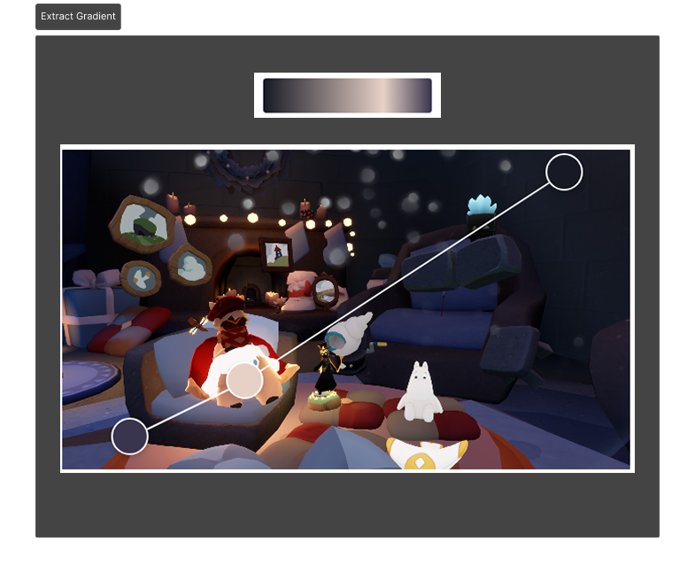
        - Створено градієнт з трьома кольоровими точками (Gradient Stops = 3)
    - Accessibility Tools:
        - Вибрана палітра Monochromatic
        - Кольори #A501E6 та #583366 для тексту та заднього фону відповідно  
            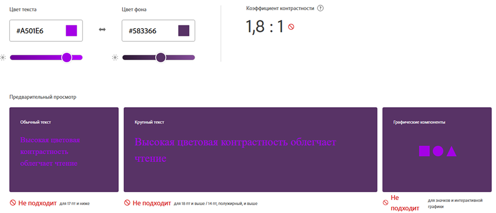  
            **Висновок:** вибір кольорів не відповідає стандарту коефіцієнта контрастності; 1,8:1 - дуже мало
        - Використано запропоновану корекцію, що змінило колір тексту на #D2A4FA  
            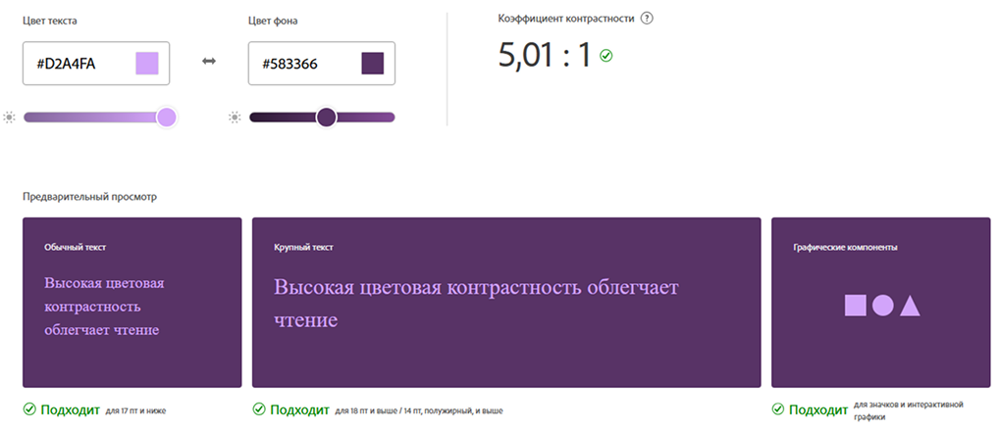  

    Посилання на проект: [workshop_11](https://www.figma.com/design/OsqdFikXPzTZ1mFty4iHGv/workshop_11?node-id=0-1&t=N9cxZEhw2jUdl5Pv-1)
4. Висновки
    >**Найзручніші для інтерфейсів** — *Monochromatic*, *Analogous*, *Muted* та *палітри з високим контрастом*, оскільки вони не перевантажують око. Важливо завжди перевіряти пари на контрастність відповідно до стандартів WCAG. _Adobe Color_ — ефективний інструмент для створення палітр, градієнтів і перевірки доступності