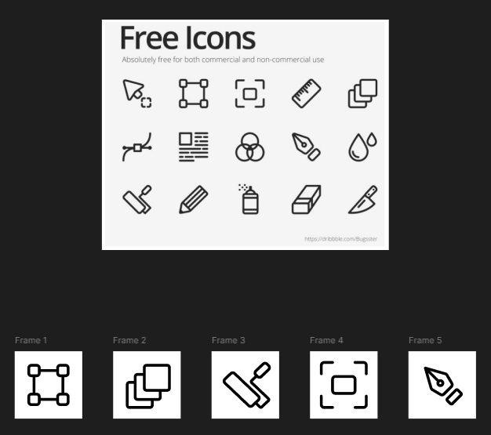

# Практична №4 - Робота з пером та вектором

## Виконала:  
**Матвєєнко Олександра**  
**Група: ІПЗ-2.03**  
[Посилання на проект в Фігма](https://www.figma.com/design/uBpDOweuxFKVttp5NI2XTX/workshop_4?node-id=0-1&t=NXY0j8zQyHo9lf5V-1)

## Завдання:
1. Переглянути матеріал лекції
2. Потренуватися з Pen Tool на сайті [The Bezier Game](https://bezier.method.ac/?authuser=0)
3. Створити  п'ять іконок за вибором у border стилі
4. Написати звіт

---

## Хід роботи:
1. Аналіз
    - Референс містить набір іконок у border-стилі
    - Іконки мають прості геометричні форми з чіткими лініями
    - Всі іконки виконані у чорно-білій кольоровій гамі
    - Розмір іконок стандартний – 24×24 px
    - Усі іконки складаються з базових геометричних фігур та кривих Безьє
2. Розробка
    - Підготовка матеріалів:
        - Вивчення роботи Pen Tool у Figma
        - Проходження [The Bezier Game](https://bezier.method.ac/?authuser=0) для практики  
            
        - Вибір п'яти іконок для відтворення
    - Створення іконок:
        - Використання Pen Tool та базових фігур
        - Робота з кривими Безьє для плавних ліній
        - Вирівнювання елементів у межах фрейму 24×24 px
        - Використання рівномірної обводки (border-style)
3. Результати  
    

    Посилання на проект: [workshop_4](https://www.figma.com/design/uBpDOweuxFKVttp5NI2XTX/workshop_4?node-id=0-1&t=NXY0j8zQyHo9lf5V-1)
