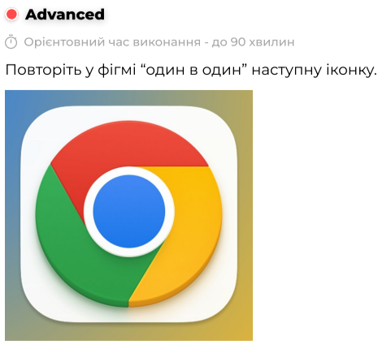
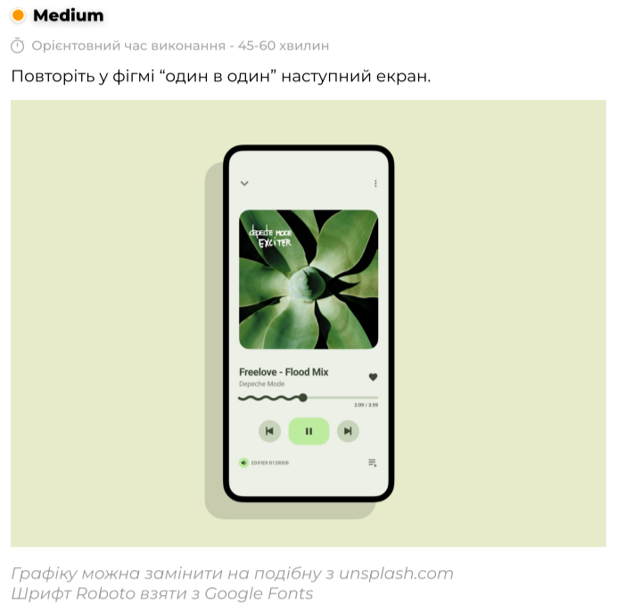
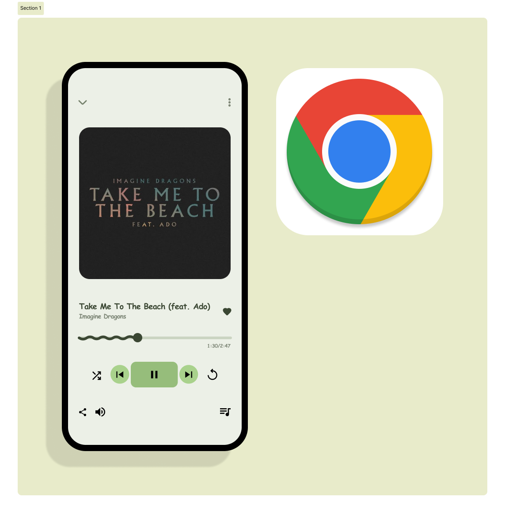

# ПЗ-4 Завдання для самостійного опрацювання (Part2)

## Виконала:  
**Матвєєнко Олександра**  
**Група: ІПЗ-2.03**  
[Посилання на проект в Фігма](https://www.figma.com/design/1v7OqdL0qMcD3jyPvKeCfO/workshop_6?node-id=0-1&t=afmD7qvqDgDvkOeF-1)

## Завдання:
1. Розглянути завдання **Basic** із прикріпленого документа
2. Повторити у фігмі “один в один” елемент дизайну представлені у файлі (Advanced та Medium - друга частина завдання)
3. Написати звіт

---

## Хід роботи:
1. Аналіз
    - Іконка Chrome складається з основи (білий квадрат із закругленими кутами) та центрального елемента (кольорові сектори та синій круг)
    - Інтерфейс плеєра містить головний екран із обкладинкою, елементами управління та текстом
    - Обидва дизайни мають м'які тіні та ефект об'єму
    - Колірна гама: Chrome використовує червоний, жовтий, зелений і синій; плеєр — пастельні тони та чорний контур
2. Розробка
    - Іконка Chrome:
        - Створення білого закругленого квадрата
        - Побудова центрального кола та кольорових секторів (червоний, жовтий, зелений)
        - Додавання синього кола в центрі з білим обводом
        - Додавання тіні для створення 3D-ефекту
    - Мобільний плеєр:
        - Створення основи (чорний контур телефону, внутрішній екран)
        - Розміщення зображення обкладинки
        - Додавання текстових елементів (назва пісні, виконавець, таймер відтворення)
        - Розташування елементів управління (кнопки навігації, прогрес-бар, іконки та інше)
        - Додавання м'якої тіні до елементів
3. Результати  
    | Елемент | Результат |
    | --- | --- |
    | Референс |  |
    | Референс |  |
    | Виконана робота |  |

    Посилання на проект: [workshop_6](https://www.figma.com/design/1v7OqdL0qMcD3jyPvKeCfO/workshop_6?node-id=0-1&t=afmD7qvqDgDvkOeF-1)

## Використані матеріали:
Іконки взяти готові з https://fonts.google.com/icons  
Шрифт Roboto взяти з Google Fonts

## Користні матеріали:
**Плагіни Figma:** 
Feather Icons,  iconsax 6000+  – імпорт значків (іконок)  

**Посилання:**
https://fonts.google.com/icons
https://www.flaticon.com
https://iconarchive.com
https://www.iconfinder.com/free_icons
https://iconmonstr.com
https://www.vecteezy.com/free-vector/icons
https://www.youtube.com/watch?v=VqQeUNmXvwU
https://www.komarov.design/nova-funktsiia-sections-u-figma-shcho-tsie-i-iak-vikoristovuvati/?authuser=0