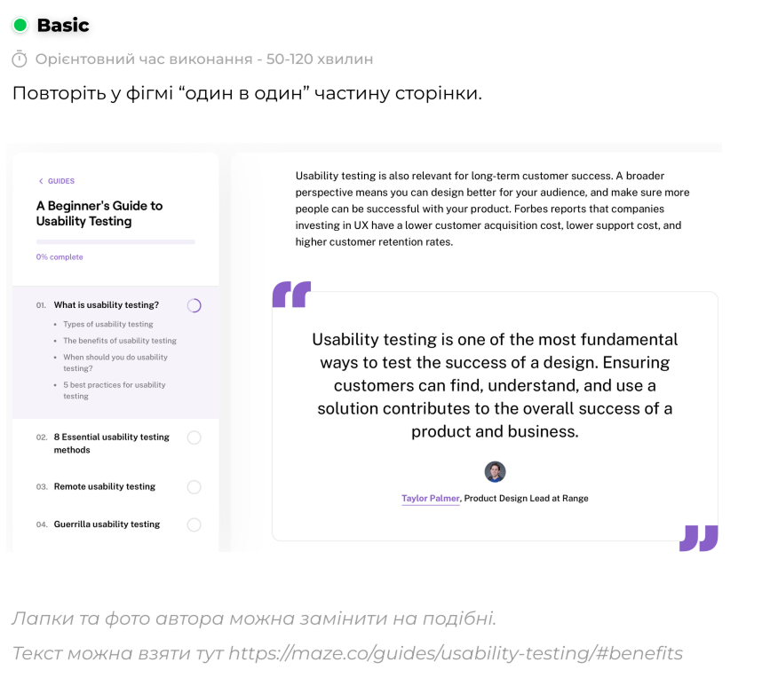

# Практична №8 Робота з простими формами та їх властивостями у Figma

## Виконала:  
**Матвєєнко Олександра**  
**Група: ІПЗ-2.03**  
[Посилання на проект в Фігма](https://www.figma.com/design/p7MtLimbLgoYP5IB06E1Qh/workshop_8?node-id=0-1&t=X35PK4wQ9Yoc4P5h-1)

## Завдання:
1. Переглянути відео: [YouTube: Текст та як із ним працювати](https://www.youtube.com/watch?v=VouVsut_-Ak&authuser=0)
2. Виконати завдання із прикріпленного файлу
3. Прикріпити знімок екрану та посилання на виконану роботу у Figma
4. Написати звіт

---

## Хід роботи:
1. Аналіз
    - Ознайомилась з відеоматеріалом
    - Ознайомлення зі структурою макету, розміщенням тексту та іншим(використання компонентів, кольорів, тіней та іконок)
    - Завдання включало створення інтерфейсу в стилі веб-сторінки з меню зліва та основним вмістом справа
    - Референс має типову UI-композицію: заголовок, список пунктів, цитата з автором
2. Розробка
    - Відкрито файл із заготовкою
    - Створено структуру з двох колонок (ліве меню та вміст сторінки)
    - Розміщено текстові блоки, відсотки виконання, пункти меню
    - Додано цитату, лапки, автора з фото
    - Створено візуальне розділення блоків
    - Застосовано шрифт Inter, подібний до Roobert
3. Результати  
    | Елемент | Результат |
    | --- | --- |
    | Референс |  |
    | Виконана робота |  |

    Посилання на проект: [workshop_8](https://www.figma.com/design/p7MtLimbLgoYP5IB06E1Qh/workshop_8?node-id=0-1&t=X35PK4wQ9Yoc4P5h-1)