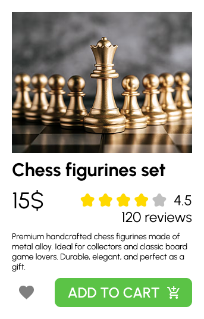

# Практична №9 Створення картки товару з використанням Auto Layout

## Виконала:  
**Матвєєнко Олександра**  
**Група: ІПЗ-2.03**  
[Посилання на проект в Фігма](https://www.figma.com/design/tmD8Y1KGfjYPDWC62aJ7qK/workshop_9?node-id=0-1&t=tq8AE5fiO0aIkGUz-1)

## Завдання:
1. Створити малу картку товару, використовуючи функцію Auto layout у Figma
2. При оформленні використати відповідне зображення, текст, значки
3. Написати звіт

---

## Хід роботи:
1. Аналіз
    - Опрацьовано відеоматеріали щодо створення UI-карток
    - Вивчено приклади візуального оформлення товарів в онлайн-магазинах
    - Визначено структуру картки: зображення товару, назва, ціна, рейтинг, кнопки
    - Ознайомленося з плагінами для імпорту зображень та іконок
2. Розробка
    - Використано Auto layout для побудови адаптивної структури
    - Імпортовано зображення шахових фігур з Unsplash
    - Додано назву
    - Застосовано ціни, рейтинг у вигляді зірок (4.5 ⭐), кількість відгуків (120 reviews)
    - Іконки завантажено через Google fonts
    - Створено кнопку для взаємодії (додати в кошик або like)
    - Додано короткий опис товару
3. Результати  
    | Елемент | Результат |
    | --- | --- |
    | Референс 1 |  |
    | Референс 2 |  |
    | Виконана робота |  |

    Посилання на проект: [workshop_9](https://www.figma.com/design/tmD8Y1KGfjYPDWC62aJ7qK/workshop_9?node-id=0-1&t=tq8AE5fiO0aIkGUz-1)